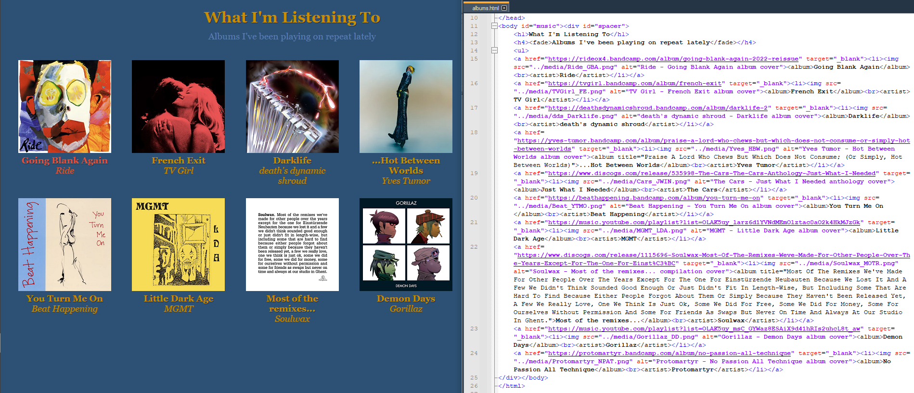
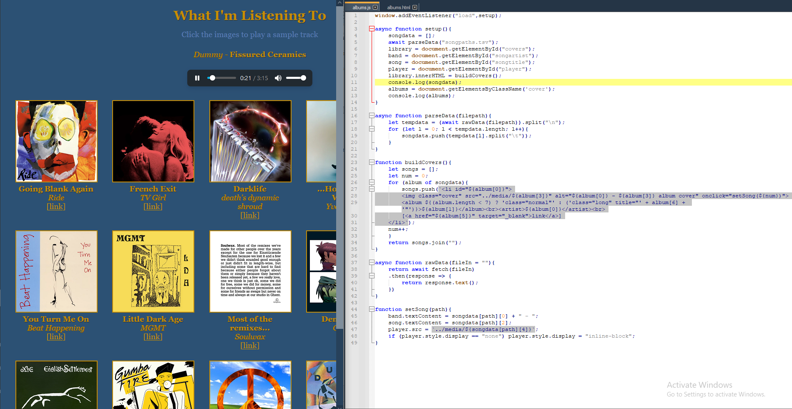
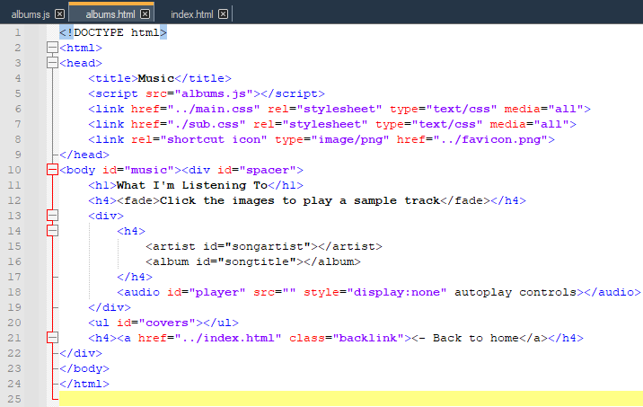
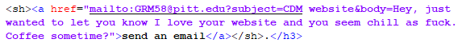

# Artist Statement
When I began working on my website project, I was immediately confronted with one of the worst obstacles anyone can face in a creative setting - the blank page. I knew what I wanted to do - rather than a professional portfolio, I was going to present the website as a kind of personal portfolio, showcasing some projects of mine and a couple of things I found interesting with a target audience not of potential employers, but of friends and peers. Even with that direction, it's still difficult to know where to start when talking about yourself. 
So, instead, I did what I often do to break the ice - I started talking about music instead. 

With this in place, I started thinking about how to challenge myself with the assignment. I work best with novelty, and since I already have experience in HTML/CSS, I knew I could write just about any page that came to mind (such as this one) without much difficulty. However, I noticed that the format of the page - uniformly formatted list items filled with variable text contents - was well-suited to being implemented using something I'm less comfortable with approaching: Javascript. I really dislike Javascript as a language (it doesn't even have *integers*), but more importantly I dread inevitably having to use it in web development, so I wanted to force myself to swallow my castor oil instead of dancing around an obvious and simple use case. 
Plus, I had an idea for how to use it to introduce an additional feature to the page. Not only did adding Javascript allow me to reduce the size of the HTML page above to just 750 characters, it also let me implement an audio player that activates when you click on any of the given albums, which I used to pick out my favorite track from each and give the whole page a slightly more personal touch. While troubleshooting the code, I also ended up adding more albums to the page to test the ease of doing so.

Next, I began working on the page for my own projects. Since I was already hosting and playing audio on the site, I decided that one of the one I'd include would be an Audacity mix I put together for fun a few weeks ago. I don't have much experience in mixing, so I wouldn't feel comfortable putting it forward as professional creative output, but fortunately that's not what the website is designed for. I held onto this casual approach while finally putting together the homepage, including jokes like the mailto default body text and "The Graham Webring" (which links to myself in both directions).

Altogether, I'm satisfied with what I accomplished in this project, and I think the experience I gained in Javascript in particular will serve me well in the future.
	